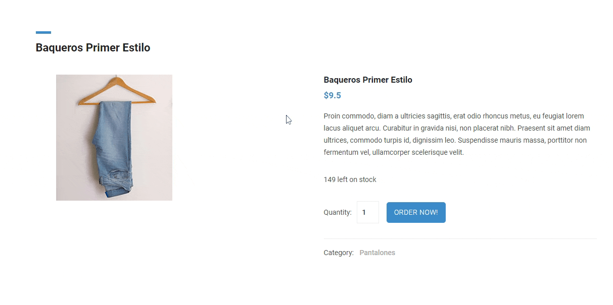
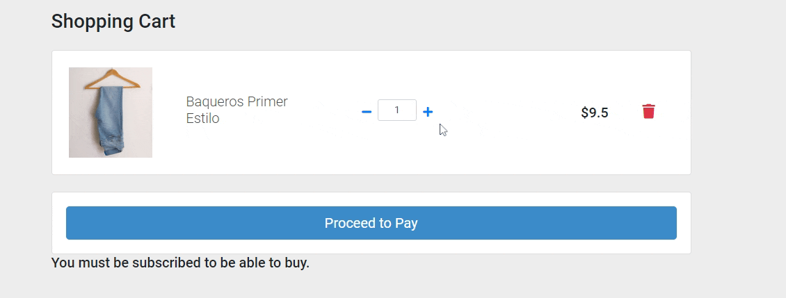
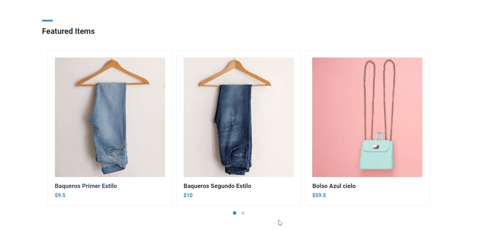
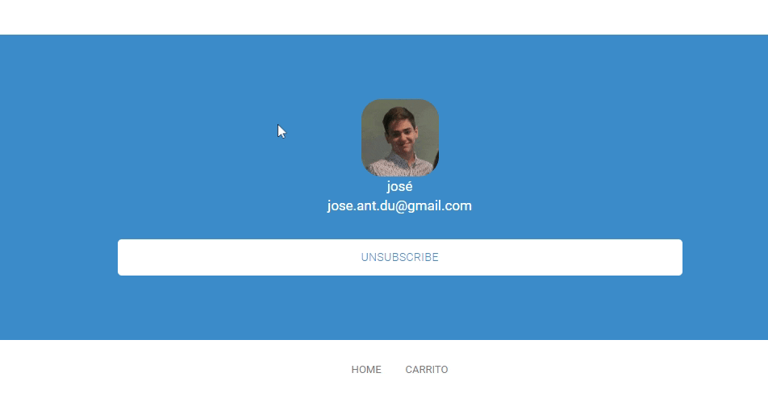

# Getting Started with Create React App
**Project name:** ToDo List/Recordatorios 
**Author:** [DainWs](https://github.com/DainWs) 
**Production test:**  
[Production GitHub](https://dainws.github.io/2DAW_ToDo_Project/) 
[Production Firebase](https://chinospaco-tienda-react.web.app/) 

Adding to the sopping car:

Paying products:

Selecting products:

Subscribing/Log in with google account:

This project was bootstrapped with [Create React App](https://github.com/facebook/create-react-app).

## Available Scripts

In the project directory, you can run:

### `npm start`

Runs the app in the development mode.\
Open [http://localhost:3000](http://localhost:3000) to view it in your browser.

The page will reload when you make changes.\
You may also see any lint errors in the console.

### `npm test`

Launches the test runner in the interactive watch mode.\
See the section about [running tests](https://facebook.github.io/create-react-app/docs/running-tests) for more information.

### `npm run build`

Builds the app for production to the `build` folder.\
It correctly bundles React in production mode and optimizes the build for the best performance.

The build is minified and the filenames include the hashes.\
Your app is ready to be deployed!

See the section about [deployment](https://facebook.github.io/create-react-app/docs/deployment) for more information.

### `npm run eject`

**Note: this is a one-way operation. Once you `eject`, you can't go back!**

If you aren't satisfied with the build tool and configuration choices, you can `eject` at any time. This command will remove the single build dependency from your project.

Instead, it will copy all the configuration files and the transitive dependencies (webpack, Babel, ESLint, etc) right into your project so you have full control over them. All of the commands except `eject` will still work, but they will point to the copied scripts so you can tweak them. At this point you're on your own.

You don't have to ever use `eject`. The curated feature set is suitable for small and middle deployments, and you shouldn't feel obligated to use this feature. However we understand that this tool wouldn't be useful if you couldn't customize it when you are ready for it.

## Requires
Proyecto React - Tienda on-line
Haciendo uso de React como Framework de desarrollo vamos a realizar una aplicación para una tienda on-line.

La aplicación debe:

- [X] Estar desarrollada mediante componentes React, debiendo al menos existir dos: producto y carrito.
- [X] Mostrar inicialmente un listado de productos, teniendo cada uno de ellos al menos un nombre, imagen y precio.
- [X] Gestionar un carrito de la compra, de tal modo que cada producto debe ser posible agregarlo al carrito. 
- [X] Si se selecciona un artículo debe mostrarse un detalle para éste.
- [X] El carrito debe disponer de vista propia que muestre un resumen de la compra así como el total a pagar.
- [X] Se valorará una correcta interfaz, basándote en cualquier plantilla gratuita para una tienda online (por ejemplo, de free-css.com) Debe prestarse atención a aspectos como la usabilidad de la web.
- [X] Debe estar en producción.
Todos los puntos anteriores son los mínimos para alcanzar un 5 en el proyecto. El resto de puntos hasta el 10 se obitenen según los siguientes puntos:

- [X] (1 punto) Almacena en local el carrito del usuario, de tal modo que si vuelve a cargar la página en el mismo navegador, el carrito se mostrará tal y como lo dejó.
- [X] (1 punto) El carrito es capaz de manejar, para cada artículo, un número mayor a 1 de elementos. Por tanto si añado una nueva unidad de un artículo ya presente en el carrito, debe incrementarse este valor y no duplicar el artículo.
- [X] (1 punto) El carrito permite modificar el número de artículos, pudiendo borrarlos o modificar su número de unidades.
- [X] (1 punto) Los artículos se cargan desde Firestore.
- [X] (1 punto) Se hace uso de rutas, como mínimo para el Home (listado artículos) y carrito. En caso de solicitarse una página inexistente debe mostrarse un error personalizado siguiendo la línea de diseño de tu tienda.
